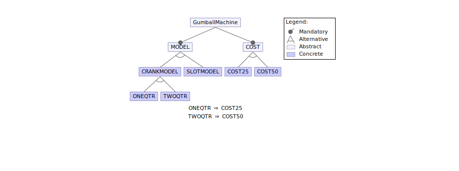
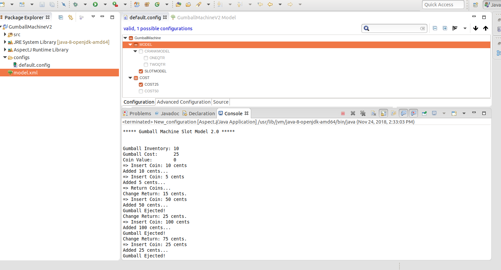
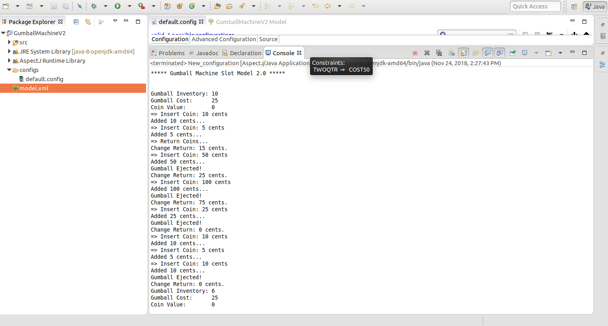
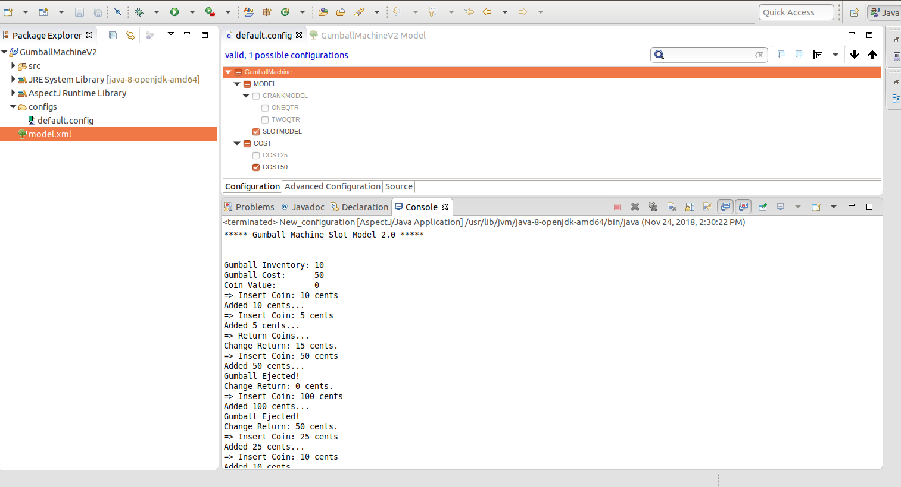

## Description
--
In Lab1 we had three different classes for different GumballMachines. To select a specific machine user had to pass the type and cost into the contructor of Gumball Machine. But with AspectJ we can select model with differnt combinations of coins and type in config file and the machince gets cofigured.

## Screenshots

